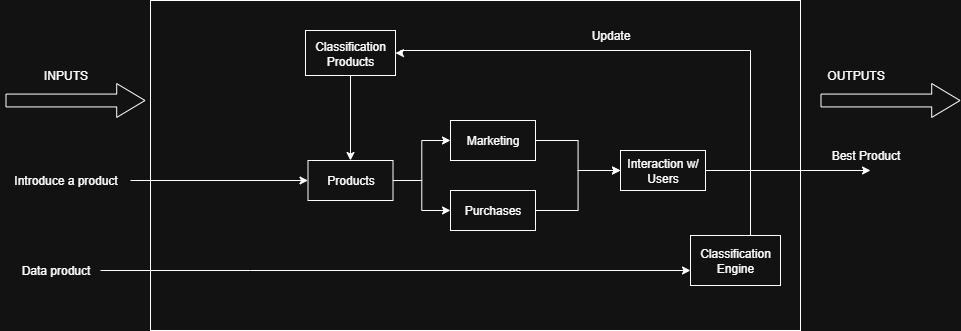
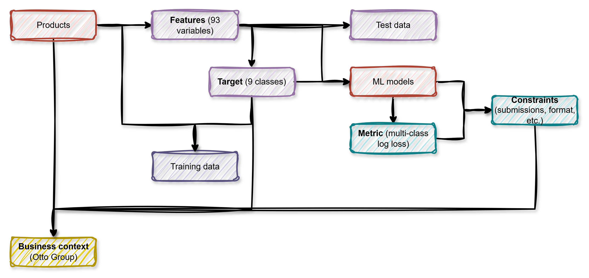

# Workshop 1 - System Analysis

This folder contains the work for Workshop 1 of the Systems Analysis course, focusing on system analysis and identification of complexity factors.

## Otto Group Product Classification Challenge

Otto Group is one of the largest e-Commerce companies in the world, having subsidiaries in more than 20 countries, including the USA with Crate & Barrel, Germany with Otto.de, and France with 3 Suisses. They sell millions of products worldwide every day, with several thousand products being added to their product line.

A consistent analysis of the performance of products is crucial. However, as a consequence of its diverse global infrastructure, many identical products are classified differently. Therefore, the quality of their product analysis depends on the ability to accurately cluster similar products. The better the classification, the more insight can be generated about product range.

## Workshop Objectives

- Identify and analyze system elements and their relationships
- Understand data characteristics (93 obfuscated features, 9 categories, 200,000+ products)
- Explore complexity and sensitivity factors using chaos theory principles
- Define system constraints and evaluation metrics (multi-class log loss)
- Establish design implications for next stages

## Key Findings

### System Elements Identified
- Products as classification units
- Obfuscated numerical variables
- Product categories and class distribution
- Training and test datasets
- Multi-class logarithmic loss metric
- Business context and constraints

### Complexity Factors
- High dimensionality (93 features)
- Data obfuscation limiting domain knowledge application
- Class imbalance affecting model design
- Sensitivity to parameter variations

## Team Members

- Juan Diego Lozada 20222020014
- Juan Pablo Mosquera 20221020026
- María Alejandra Ortiz Sánchez 20242020223
- Jeison Felipe Cuenca 20242020043

## Diagrams

### System E-commerce Architecture

### Correlation Between Elements

## Deliverables

- System analysis report (main.tex)
- System element identification
- Complexity and sensitivity analysis
- Design implications for system architecture
